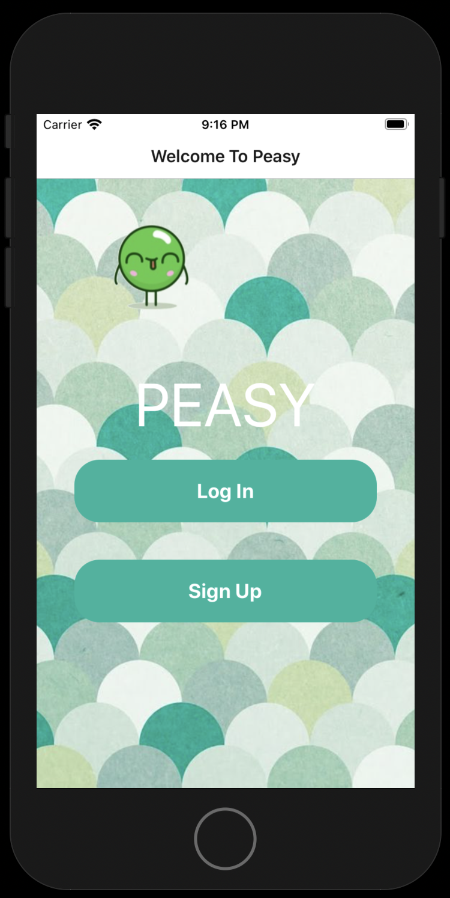
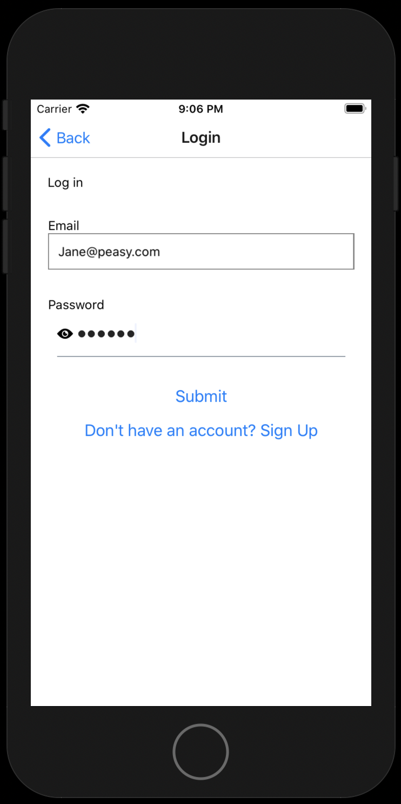
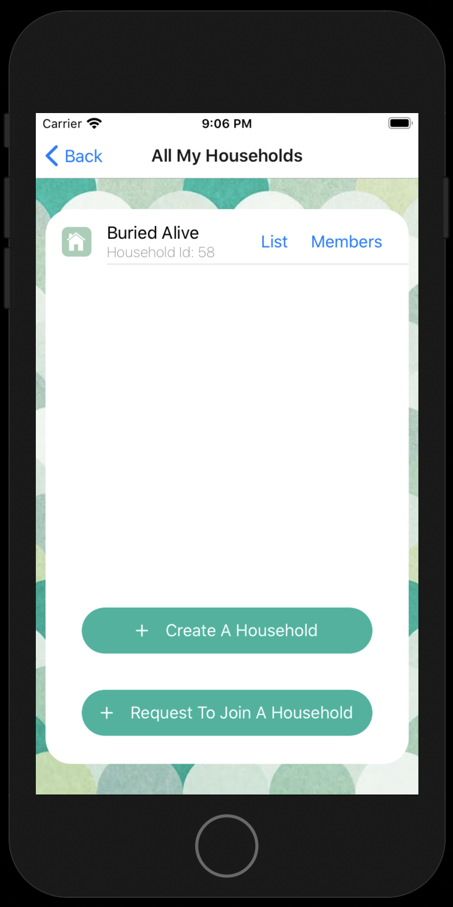
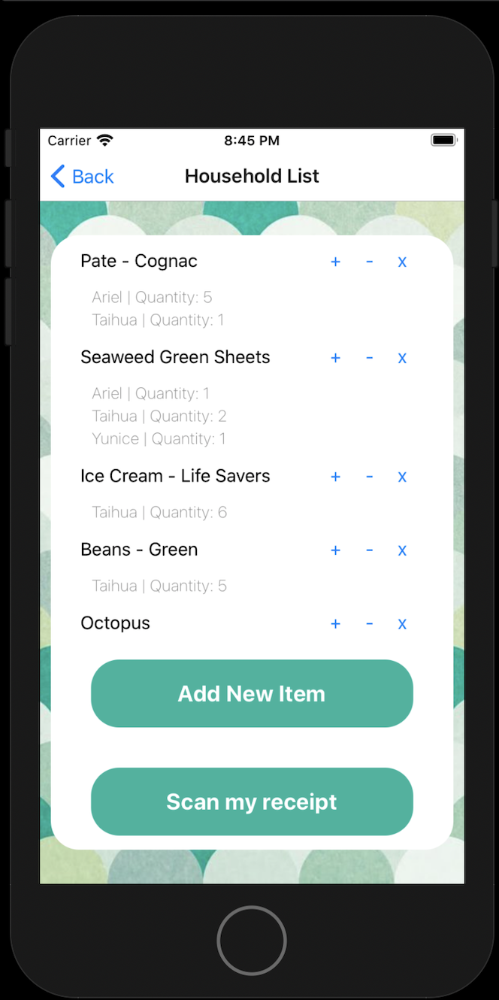
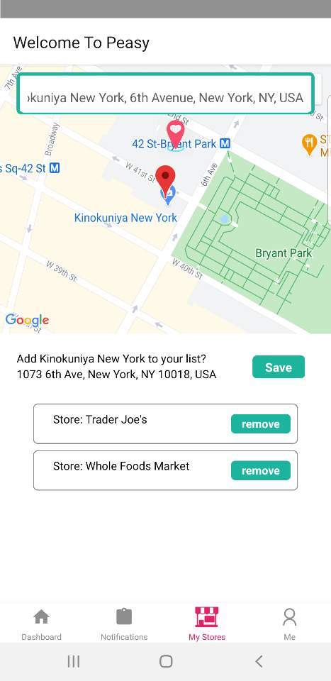
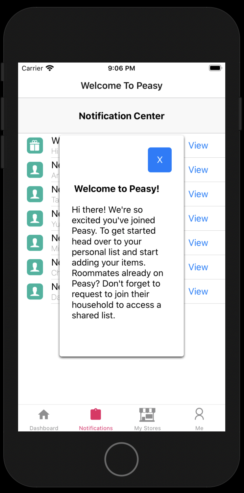
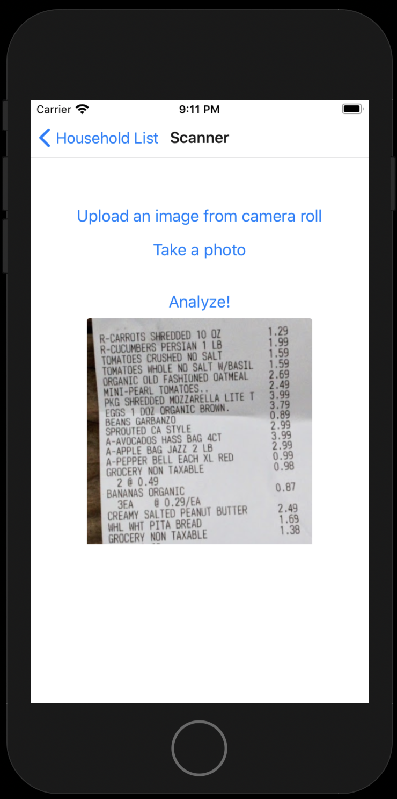
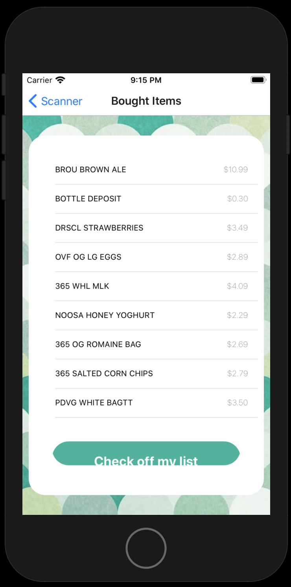
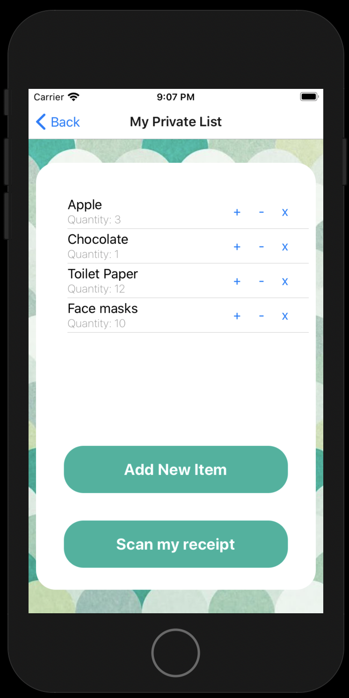

# PEASY

## Collaborative Shopping Made Easy


Peasy is your collaborative shopping list made easy!

Join with your housemates and create a household shopping list, where everyone can add the items they need to buy.
Select your preferred stores.

Whenever you or a housemate is close to your preferred stores, Peasy will send a reminder to get the items from the list.
Keep your private items in your specific list, only you will see these and only you will receive reminders about them.

[](https://www.youtube.com/watch?v=IcBzg9G8zfE)

---

## Tech-Stack:

Our application was written in React Native and powered by Expo. Below is a non-exhaustive list of technologies used throughout the project.

| Back End | Front End | APIs | Libraries
| ----------- | ----------- | ----------- | ----------- |
| Sequelize | React Native | Google Maps | Formik
| Node.js | React Hooks | Expo location | async-storage
| Express | Redux (hooks) | Google Vision | vector-icons
| Firebase | HTML & CSS |  |


---

## How to use Peasy:

If you want to play around with Peasy, feel free to clone our repo. To start, please enter the following commands on your terminal:

```shell
git clone https://github.com/2006-ghp-capstone-team-B/capstone-b.git
cd capstone-b
npm install
npm start
```

Once you do npm start, a new window will open up on your browser with the expo console. For best results, please run the app on your phone (you will need to download the expo app) or on a simulator (you will be prompted to download it if you don't have any). For more information, please see [Expo's documentation](https://docs.expo.io/get-started/installation/).


---

## PEASY Features:

You must create an account to use Peasy! Sign Up easily with just an email address, password, and your name:






Create or join a shared household shopping list, where everyone can add the items they need to buy. If someone in your household already set up a list, just join it by introducing the household id and wait for their confirmation. 






Select your preferred stores. Whenever you or a housemate is close to your preferred stores, Peasy will send a push notification reminding you to get the items from the list. Don’t worry, you will only receive these notifications a couple times per day, and only if you are within 200m of any of your preferred stores.

You also have a notifications center, where you can see messages pertaining your household activities.






When someone has taken care of the shopping, you can easily upload your receipt, scan it, and check-off items from the shared shopping list for easier bill splitting. 





Don’t feel comfortable sharing some of your items? Add them to your private list, and only you will see them or receive reminders when you walk by your preferred store.




---

## About The Amazing Creators of Peasy:
This app was born as a final project for our fullstack software engineering bootcamp: The Grace Hopper Program from Full Stack Academy. We learned how to develop fullstack applications and then supplemented with a good dose of our own research to come up with a fully functional application that we deemed useful and necessary in our lives.

We are very proud of the result, especially given the short amount of time to learn and apply our knowledge, and are very excited to keep improving it as we grow as professional software engineers.

Feel free to reach out to us if you want to learn more about Peasy and us!

| Full Name |  |  | 
| ----------- | ----------- | ----------- |
| 🌶️Yunice (Yu) Xiao  | [YuniceXiao](https://github.com/YuniceXiao) | [/in/fishxy2/](https://www.linkedin.com/in/fishxy2/) |
| 🥓Ariel Wainer | [arielwainer4](https://github.com/arielwainer4) | [/in/arielwainer/](https://www.linkedin.com/in/arielwainer/) |
| 🍠Taihua Rubin | [TaihuaRubin](https://github.com/TaihuaRubin) | [/in/taihuarubin/](https://www.linkedin.com/in/taihuarubin/) |
| 🥘Cecilia Yu Chung Chang | [ceciliachung](https://github.com/ceciliachung) | [/in/cecilia-yu-chung-chang/](https://www.linkedin.com/in/cecilia-yu-chung-chang/) |

